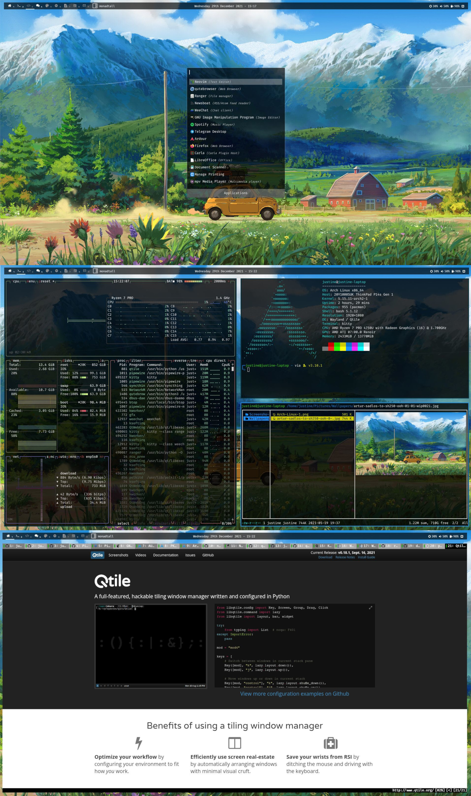

# Various dotfiles for my [Sway WM](https://www.sway.org/) setup.
Sway is a tiling Wayland compositor and a drop-in replacement for the i3 window manager for X11. It works with your existing i3 configuration and supports most of i3's features, plus a few extras.  
**Please note that I use the latest  versions of Sway, Wayland and Wlroots from their GitHub repos using the AUR.**

## Details

Below is a list of some of the packages that I use for my current setup.

- **Operating System** --- [Archlinux](https://www.archlinux.org/)
- **AUR Helper** --- [Paru](https://aur.archlinux.org/packages/paru-git/)
- **Boot Loader** --- [Grub](https://wiki.archlinux.org/index.php/GRUB)
- **Window Manager** --- [Sway](https://aur.archlinux.org/packages/sway-git)
- **Screen Locker** --- [Swaylock Effects](https://aur.archlinux.org/packages/swaylock-effects-git)
- **Shell** --- [Bash](https://wiki.archlinux.org/index.php/Bash) using [Starship](https://aur.archlinux.org/packages/starship-git/) 
- **Terminal** --- [Kitty](https://wiki.archlinux.org/index.php/Kitty)
- **Notification Daemon** --- [Mako](https://aur.archlinux.org/packages/mako-git)
- **Application Launcher** --- [Rofi Wayland](https://aur.archlinux.org/packages/rofi-lbonn-wayland-git)
- **File Manager** --- [Ranger](https://aur.archlinux.org/packages/ranger-git)
- **Editor** --- [Neovim](https://aur.archlinux.org/packages/neovim-git)
  - **Plugins**
	- [gruvbox](https://github.com/morhetz/gruvbox)
	- [coc.nvim](https://github.com/neoclide/coc.nvim)
	- [vim-polyglot](https://github.com/sheerun/vim-polyglot)
	- [vim-startify](https://github.com/mhinz/vim-startify)
	- [tagbar](https://github.com/preservim/tagbar)
	- [nerdtree](https://github.com/preservim/nerdtree)
	- [vim-devicons](https://github.com/ryanoasis/vim-devicons)
	- [vim-airline](https://github.com/vim-airline/vim-airline)
	- [vim-airline-themes](https://github.com/vim-airline/vim-airline-themes)
	- [indentLine](https://github.com/Yggdroot/indentLine)
	- [vim-hexokinase](https://github.com/rrethy/vim-hexokinase)
- **Web Browser** --- [Qutebrowser](https://www.qutebrowser.org)
- **PDF Viewer** --- [Zathura](https://wiki.archlinux.org/index.php/Zathura)
- **IRC** --- [Weechat](https://weechat.org/)
- **RSS Feed Reader** --- [Newsboat](https://aur.archlinux.org/packages/newsboat-git)
- **Youtube search** --- [Ytfzf](https://aur.archlinux.org/packages/ytfzf/)
- **Video player** --- [Mpv](https://aur.archlinux.org/packages/mpv-git)

## Keybindings
### Window manager controls
| Keys                                 | Action                    |
| ------------------------------------ | ------------------------- |
| <kbd>SHIFT + MOD + c</kbd>           | reload Sway config        |
| <kbd>SHIFT + MOD + e</kbd>           | Exit Sway                 |
| <kbd>SHIFT + ALT + q</kbd>           | kill window               |
| <kbd>MOD + RETURN</kbd>              | spawn terminal            |
| <kbd>MOD + d</kbd>                   | Rofi menu                 |
| <kbd>SHIFT + MOD + p</kbd>           | Rofi power menu           |
